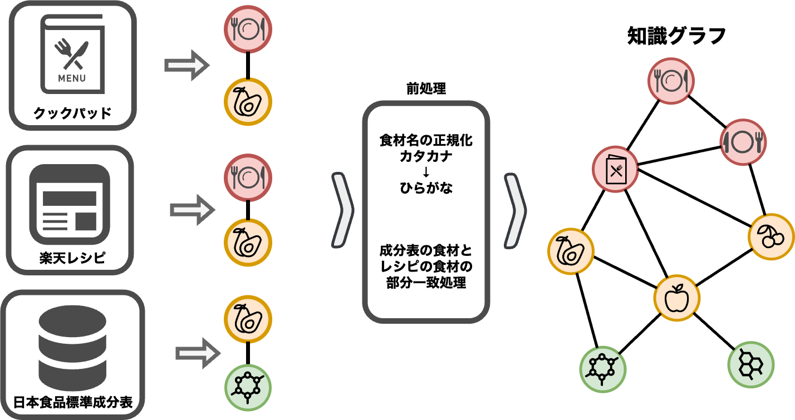

# 日本語レシピ-食材知識グラフ (JapaneseFoodKG) 
## 概要(version 1.0)
日本語データで作成したレシピー食材ー栄養素の知識グラフです．大規模なレシピデータ（約200万件）と日本食品成分表に掲載された栄養素データを用いて知識グラフを作成することができます．

## 説明
食にかかわる研究は古来より行われてきており，特に情報学分野では食メディア（Food Computing）と題して様々な研究が行われています．
食べる行為は人間にとって万人が毎日一生行う行為であるといえ，それらの支援が必要になると言えます．
多くの人々が健康やダイエット，特定の医療条件への対応（アレルギーや糖尿病，心臓病など）から，文化的・宗教的な食の制限まで，様々な理由で特別な栄養要件や食事制限を持っています．
これにより，個々のニーズに合わせた栄養素を考慮したレシピの提供が不可欠となっていますが，レシピと栄養情報を効果的に統合し，ユーザーに適切な食事を提案するアプリケーションはまだ十分に普及していません．


これらの背景に効果的な技術の一つとして，知識グラフ技術の利用が挙げられます．
知識グラフは，レシピの成分と栄養素の間の関係を明確に表現し，検索や推薦などのプロセスを改善するための豊富な文脈情報を提供します．この技術は，個々の食事の要件に基づいて最適化された食事を提供することが可能で，ユーザーが健康的な食生活を送るサポートをするための強力なツールとなり得ます．
確かに，最新の大規模言語モデル（LLM）は人間に似たテキストを生成する能力において飛躍的な進展を遂げていますが，それらが出力する情報の正確性や信頼性には限界があります．
LLMはトレーニングされたデータに基づいて予測を行うため，誤った情報や偏見を含む可能性があり，これが健康や食生活に関する誤解や不適切な判断を招くリスクにつながります．

そこで本リポジトリでは，日本語のレシピや栄養素データから知識グラフを構築しました．
各データ提供元からデータを取得し，適切なフォルダパスに置くことで知識グラフを作ることができます．
本リポジトリの活用により，以下の様々な応用アプリケーションにおける基盤技術として使うことが期待できます．

- オントロジを考慮した食材検索
- 特定の栄養素を加味したレシピ推薦
- 化合物を加味したレシピ効果の推定

本リポジトリが行う処理のイメージ図は以下です．



レシピ・栄養素（化合物）はそれぞれ独自のURIを持ちますが，食材は食材名で一致しているかを処理し独自のURIを振っています．
グラフ構成要素は以下です．

<table align="center" style="border-collapse: collapse; width: 60%;" border="1">
  <thead>
    <tr>
      <th style="text-align: center;">構成要素</th>
      <th style="text-align: center;">データの種類</th>
      <th style="text-align: center;">データソース</th>
    </tr>
  </thead>
  <tbody>
    <tr>
      <td style="text-align: center;" rowspan="3">ノード</td>
      <td style="text-align: center;">レシピ</td>
      <td style="text-align: center;">Cookpad，楽天レシピ</td>
    </tr>
    <tr>
      <td style="text-align: center;">食材</td>
      <td style="text-align: center;">Cookpad，楽天レシピ，日本食品標準成分表</td>
    </tr>
    <tr>
      <td style="text-align: center;">栄養素</td>
      <td style="text-align: center;">日本食品標準成分表</td>
    </tr>
    <tr>
      <td style="text-align: center;" rowspan="3">エッジ</td>
      <td style="text-align: center;">レシピ -- 食材</td>
      <td style="text-align: center;">Cookpad，楽天レシピ</td>
    </tr>
    <tr>
      <td style="text-align: center;">食材 -- 食材</td>
      <td style="text-align: center;">日本食品標準成分表</td>
    </tr>
    <tr>
      <td style="text-align: center;">食材 ---栄養素</td>
      <td style="text-align: center;">日本食品標準成分表</td>
    </tr>
  </tbody>
</table>

#### 各データの処理詳細
- ノード
  - レシピノード： Cookpad，楽天データから得られます．料理を作るためのレシピであり，今回のノード単位としてはレシピタイトルを対象としています．
  - 食材ノード：Cookpad，楽天データ，日本食品標準成分表から得られます．レシピデータに含まれる食材に対しては「カタカナ」→「ひらがな」を行う処理を行っており，食材の統一性を図っています．（食材の正規化問題はいくつか議論があり，通常の言語処理ツールなどを用いてしまうと「揚げナス」と「ナス」などの性質が全く違う重要な情報を表現できない可能性があるため，簡単な処理にしています．）  
  - 栄養素ノード： 日本食品標準成分表で記載されている栄養素です．栄養素の単位は **タンパク質** から **トリプトファン(C11H12N2O2)** などの化学式で表すことができるものです．今回成分表で用いられている英語での略称（PROT-:タンパク質，TRP:トリプトファン）をノード単位としてグラフ上に位置しています．([略称の詳細PDF](https://www.mext.go.jp/content/20230428-mxt_kagsei-mext_00001_011.pdf))

- エッジ
  - レシピー食材エッジ： 各レシピデータでその食材がレシピに含まれていればエッジを張っています．
  - 食材ー食材エッジ： このエッジは成分表から作られています．日本食品標準成分表の食材名には「中分類」「大分類」などがあるため，これらを分ける処理を行い，**食材文字列の含有** を基に 「レシピの食材」 <-> 「成分表の食材」をつなげています．これによりレシピに書かれた食材に対して大分類や中分類の食材ノードがつながることで，オントロジ機能の一部を構築可能になっています．（改善予定）
  - 食材ー栄養素エッジ： こちらも成分表から得られています．成分表で値（含有量）が掲載されているものにエッジを張っており，そのプロパティとしてその値を構築しています．


# 実行方法
## 1.データ準備
このリポジトリでは，レシピデータとして**クックパッドデータ**，**楽天レシピデータ**を，栄養素データとして，
**日本語食品標準成分表データが**必要です．

### レシピデータ
ダウンロードには国立情報学研究所との契約が必要です．（[対象URL(クックパッド)](https://www.nii.ac.jp/dsc/idr/cookpad/)）（[対象URL(楽天)](https://www.nii.ac.jp/dsc/idr/rakuten/)）

#### クックパッドレシピデータ
- Mysqlサーバが必要です．各自で作成してください．
（[こちら](https://github.com/maru008/cookpad-mysql-docker)にDockerで構築するリポジトリを公開しています）

#### 楽天レシピデータ
- 楽天データは以下のディレクトリになるように設置してください．
```python 
├─data_recipe_Rakuten #楽天データ (910 MB)
│      recipe01_all_20170118.txt
│      recipe02_material_20160112.txt
│      recipe03_process_20160112.txt
│      recipe04_tsukurepo_20160112.txt
```

### 日本食品標準成分表データ
文科省から出ている日本食品成分表をダウンロードしてください．
このリポジトリでは[日本食品標準成分表（八訂）増補2023年](https://www.mext.go.jp/a_menu/syokuhinseibun/mext_00001.html)を使用します．
すべてのデータを以下のようなディレクトリ構造で保存してください．
(7.69 MB)
```
├─mtx_01 #成分表
│      20230428-mxt_kagsei-mext_00001_012.xlsx
│
├─mtx_02 #アミノ酸成分表
│      20230428-mxt_kagsei-mext_00001_022.xlsx
│      20230428-mxt_kagsei-mext_00001_023.xlsx
│      20230428-mxt_kagsei-mext_00001_024.xlsx
│      20230428-mxt_kagsei-mext_00001_025.xlsx
│
├─mtx_03 #脂肪酸成分表
│      20230428-mxt_kagsei-mext_00001_032.xlsx
│      20230428-mxt_kagsei-mext_00001_033.xlsx
│      20230428-mxt_kagsei-mext_00001_034.xlsx
│
└─mtx_04 #炭水化物成分表
        20230428-mxt_kagsei-mext_00001_042.xlsx
        20230428-mxt_kagsei-mext_00001_043.xlsx
        20230428-mxt_kagsei-mext_00001_044.xlsx
```

## 2.環境

このリポジトリは以下の環境での動作が確認されています．
- python: 3.10.12
- pip: 22.0.2

上記の環境のもと，以下のコマンドでモジュールをインストールしてください．
```
pip install -r requirment.txt
```

### 環境変数設定
以上の情報をconfig.iniファイルに記入します．（config_sample.iniに以下と同じテンプレートがあるので名前を変更して使ってください）

```ini
[Data]
cookpad_db_port = 3306 #cookpadのMYSQLサーバのポート
rakuten_data_path = /path/to/rakuten #楽天データのデータパス
nutrition_data_path = /path/to/seibunhyo #成分表のデータパス

[Database] #cookpadのMYSQLサーバの設定
ROOT_PASS=root
DB_NAME=cookpad-recipe-db
DB_USER=user
DB_PASS=password

[Output] #KGや途中経過のCSVファイルを出力するパス
output_path = /path/to/HDD
```
（個人的にですが，使うクックパッドのデータや楽天データ，出力されるCSV,KGは容量が大きいので，外部HDDに保存して，このパスで別HDDなどを指定しておくと便利です）

## 3.前処理
適切にデータを配置したら各データについて自動で前処理を行います．
src/ のディレクトリで以下を実行．

```
python preprocessing_data.py
```

処理が完了して以下のデータが作られれば成功です．
- cookpad_edges.csv
- rakuten_edges.csv
- seibunhyo_edges.csv

## 4.知識グラフ作成
ローカルに一時保存されたCSVファイルを基に rdf 形式の知識グラフを作成します．
src/ のディレクトリで以下を実行．

```
python create_kg.py
```
各データを読み込んで，outputに設定したところに以下のファイルが完成します．

- JapaneseFoodKG.ttl
- JapaneseFoodKG.rdf

それを用いて各自のSPQRQLエンドポイントに入れることで使えるようになります．


---

### 備考
- 本リポジトリは[LODチャレンジ2023](https://2023.lodc.jp/)に合わせて作成されたリポジトリです．
- 問い合わせ等は yoshimaru[at]mil.doshisha.ac.jp まで

---
### バージョン履歴
- version1.0.0 リポジトリ公開:  (2023/10/15)